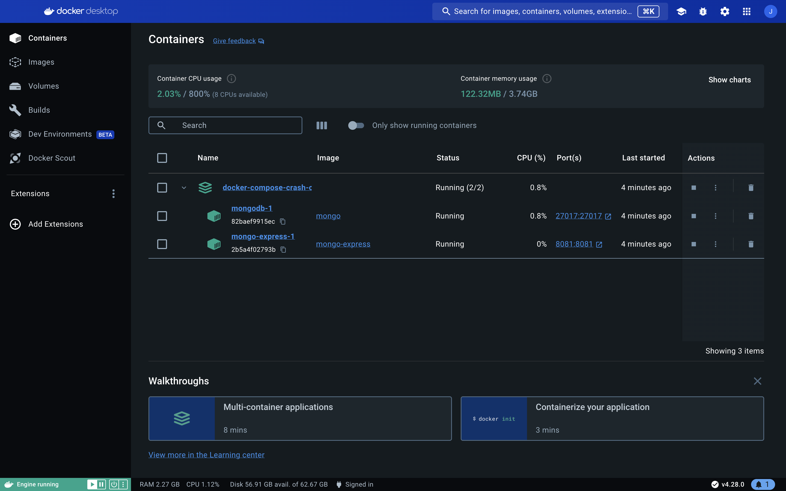
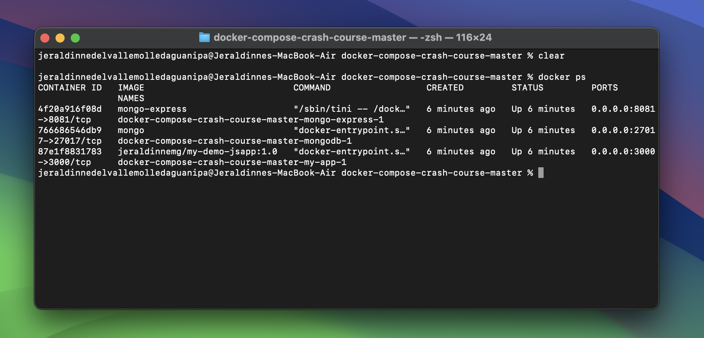

## demo app - for docker-compose crash course

Docker Compose is a tool for defining and running multi-container Docker applications. With Compose, you use a YAML file to configure your application's services.

This is a demo practice for running a Js Application - Mongo DB using docker compose.

### With Docker

#### To start the application

Step 1: Create docker network

    docker network create mongo-network 

Step 2: start mongodb 

    docker run -d -p 27017:27017 -e MONGO_INITDB_ROOT_USERNAME=admin -e MONGO_INITDB_ROOT_PASSWORD=password --name mongodb --net mongo-network mongo    

Step 3: start mongo-express
    
    docker run -d -p 8081:8081 -e ME_CONFIG_MONGODB_ADMINUSERNAME=admin -e ME_CONFIG_MONGODB_ADMINPASSWORD=password --net mongo-network --name mongo-express -e ME_CONFIG_MONGODB_SERVER=mongodb mongo-express   

_NOTE: creating docker-network in optional. You can start both containers in a default network. In this case, just emit `--net` flag in `docker run` command_

### With Docker Compose

#### To start the application

Step 1: start mongodb and mongo-express

    docker-compose -f docker-compose.yaml up
    
_You can access the mongo-express under localhost:8080 from your browser_
    
Step 2: open mongo-express from browser

    http://localhost:8081

Step 3: create `my-db` _db_ and `my-collection` _collection_ and _document_ with `{myid: 1, data: "some dynamic data loaded from db"}` in mongo-express
    

Step 4: Access you nodejs application UI from browser

    http://localhost:3000
    

## Docker compose practice.
- Docker desktop

- Docker commands

- Docker Hub

- Mongo expresss

- Application

This is the docker-compose practice from Tech with Nana  https://www.youtube.com/watch?v=SXwC9fSwct8